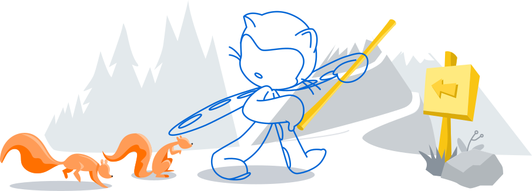

<!-- <h1 align="center">Hi 👋, I'm Lajim </h1> -->
<!-- <h3 align="center">A CS student from Bangladesh</h3> -->

<samp>
    <h1 align="center">Hey there!</h1>
</samp>

<samp>
    <h3 align="center">I am <code><b>Abrar Khatib Lajim</b></code></h3>
    
</samp>

<!-- Git Header SVG -->

<b>

&nbsp;***About Me:***

Aspiring Software Engineer 🚀  Dart, Kotlin & Java Enthusiast 💻  Exploring the fusion of tech, creativity, and human connection 🌍  Guy with a passion for ideas that matter.

## 🌐 Socials:
      

 

&nbsp; 
&nbsp; ***Tech Stack:***

                

&nbsp;***Github Stats***

 

<table align="center">
<tr>
<td width="50%" align="center">
    
    
</td>
<td width="50%" align="center">
    
</td>
</tr>
</table>

 

<!--### ✍️Dev Quote

### 🔝 Top Contributed Repo
// -->

